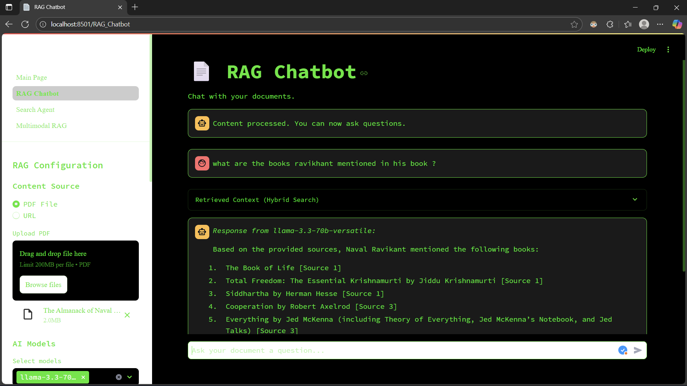
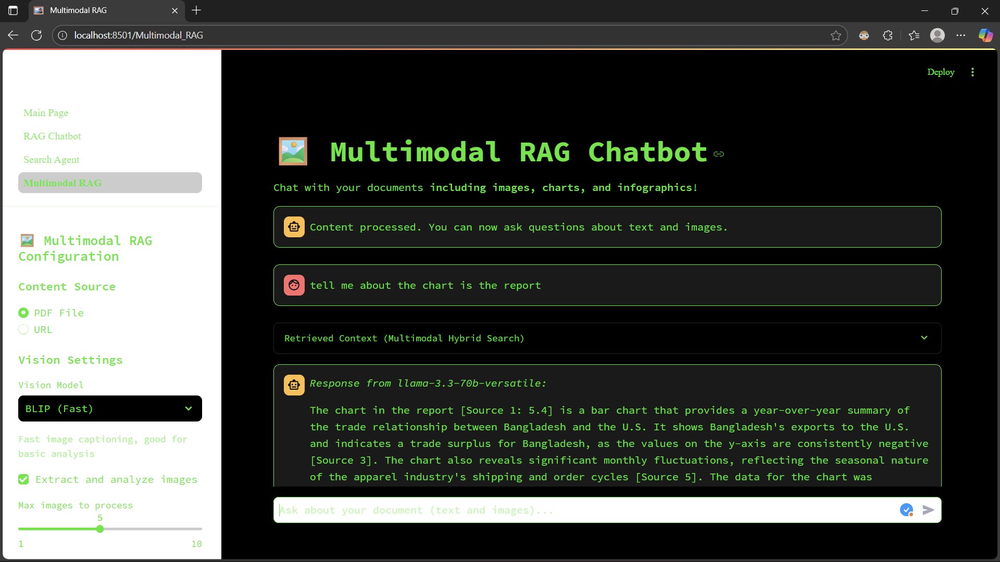
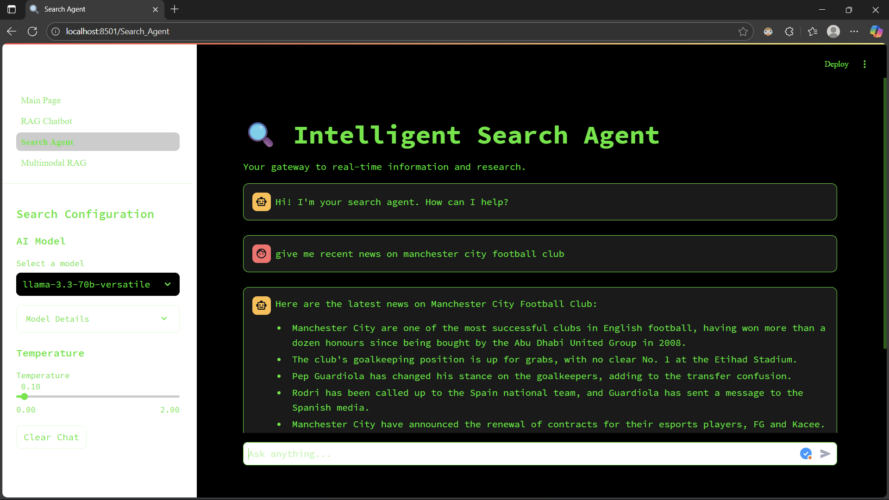
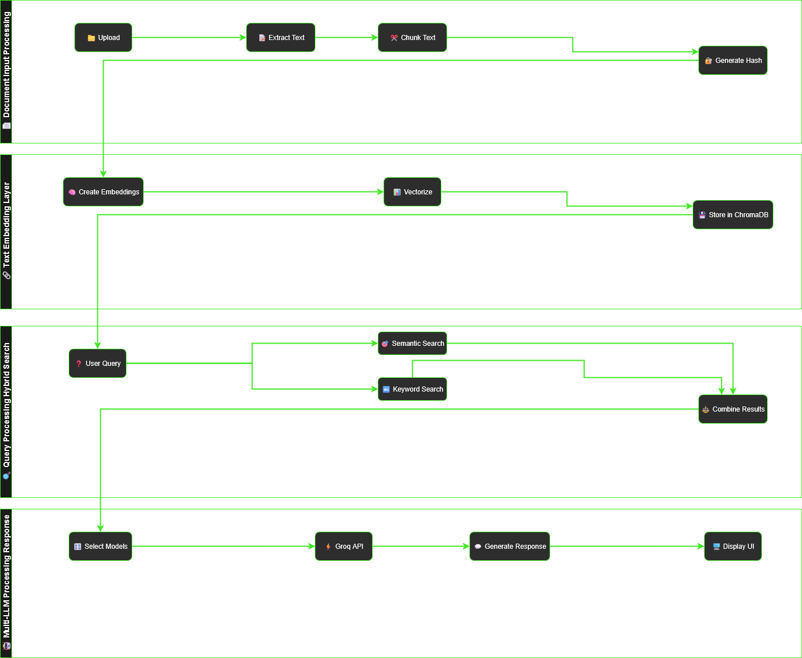
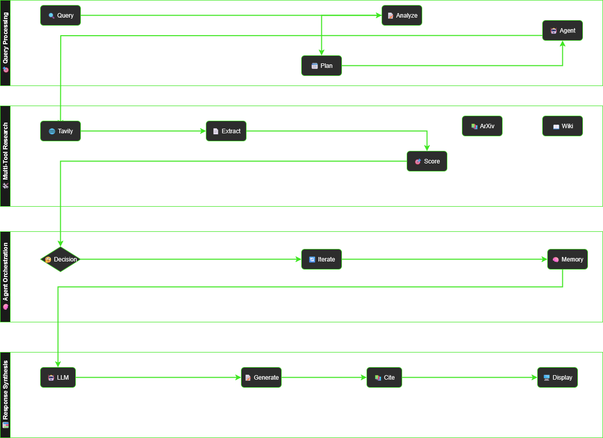
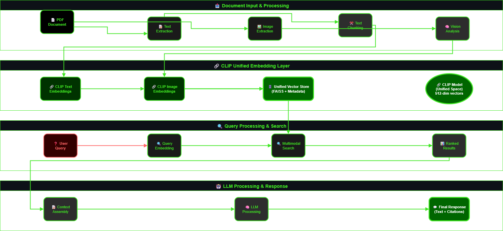

# Cortex AI: Multi-Model Insights Hub

🤖 **Advanced AI-Powered Document Analysis with Multimodal RAG Capabilities**

Cortex AI Hub integrates multiple Large Language Models (LLMs) with a sophisticated **Multimodal Retrieve-and-Generate (RAG)** system, enabling you to extract insights from **text, visual content, and video transcripts**.

**✨ NEW: Premium Dark Theme UI with Glassmorphism** - Modern, sleek interface with neon green accents, smooth animations, and frosted glass effects!

---

## 🌟 **Key Features**

### 📺 **YouTube Analyst** ⭐ NEW!

- **🎬 Video Transcript Extraction**: Automatically fetch YouTube video transcripts
- **📝 AI-Powered Summaries**: Generate comprehensive video summaries with key takeaways
- **💬 Interactive Chat**: Ask questions about video content using RAG technology
- **🔍 Hybrid Search**: Semantic + keyword search across video transcripts
- **⚡ Real-Time Analysis**: Instant insights from any YouTube video

### 🖼️ **Multimodal RAG**

- **📊 Visual Content Understanding**: Analyze images, charts, graphs, and infographics
- **🔗 Unified Text-Image Search**: Search across both textual and visual content
- **🎯 Context-Aware Analysis**: Enhanced understanding with specialized prompts
- **💾 Persistent Storage**: Efficient multimodal embeddings with pickle storage
- **🆓 Free & Local**: Uses open-source models (BLIP, BLIP-2, GIT)

### 🔍 **Advanced Search & RAG**

- **🧠 Hybrid Search**: Combines semantic vector search with BM25 keyword search
- **📂 Multi-Document Support**: Upload PDFs or provide URLs
- **💾 Persistent Vector Database**: ChromaDB-powered storage
- **✅ Accurate Citations**: Source-linked responses with references

### 🤖 **AI-Powered Search Agent**

- **🌐 Real-Time Research**: ArXiv, Wikipedia, and Tavily web search tools
- **📰 Current Information**: Up-to-date news and research insights
- **⚡ Instant Responses**: Fast, context-aware answers
- **🔊 Text-to-Speech**: Read aloud feature using Edge TTS (en-US-AriaNeural voice)

### 🎨 **Premium UI/UX**

- **🌙 Glassmorphic Dark Theme**: Sleek dark interface with frosted glass effects
- **✨ Smooth Animations**: Hover effects, transitions, and micro-animations
- **🎨 Modern Typography**: Inter font family with gradient text effects
- **📱 Responsive Design**: Works beautifully on all screen sizes
- **💫 Neon Accents**: Eye-catching neon green highlights

---

## 🚀 **Supported AI Models**

| Model                        | Provider | Best For                      |
| ---------------------------- | -------- | ----------------------------- |
| llama-3.3-70b-versatile      | Meta     | Complex reasoning, analysis   |
| llama-3.1-8b-instant         | Meta     | Quick queries, fast responses |
| meta-llama/llama-guard-4-12b | Meta     | Safety and content moderation |
| openai/gpt-oss-120b          | OpenAI   | Complex analysis tasks        |
| openai/gpt-oss-20b           | OpenAI   | Balanced performance          |

### 🖼️ **Vision Models**

| Model  | Description            | Best For                     |
| ------ | ---------------------- | ---------------------------- |
| BLIP   | Quick image captioning | Speed, basic analysis        |
| BLIP-2 | Advanced understanding | Complex visual content       |
| GIT    | Detailed descriptions  | Charts, graphs, infographics |

---

## 📸 **Application Screenshots**

### 🤖 **RAG Chatbot Interface**


_Traditional RAG chatbot with document upload and multi-LLM selection_

### 🖼️ **Multimodal RAG Interface**


_Enhanced multimodal interface with vision model selection and image analysis_

### 🔍 **Search Agent Interface**


_AI-powered search agent with real-time research capabilities_

---

## 🔄 **System Architecture**

### 📊 **RAG Chatbot Workflow**


_Complete RAG chatbot workflow with document processing, hybrid search, and multi-LLM response generation_

### 🤖 **Search Agent Workflow**


_AI-powered search agent workflow with multi-tool research and intelligent orchestration_

### 🖼️ **Multimodal RAG Workflow**


_Enhanced multimodal workflow combining text and visual content analysis_

---

## 🚀 **Getting Started**

### 📋 **Prerequisites**

- Python 3.11+
- Git
- API Keys: Groq and Tavily

### 📥 **Installation**

1. **Clone Repository**

   ```bash
   git clone https://github.com/RobinMillford/Cortex-AI-Multi-Model-Insights-Hub.git
   cd Cortex-AI-Multi-Model-Insights-Hub
   ```

2. **Setup Environment**

   ```bash
   python -m venv venv
   source venv/bin/activate  # Windows: venv\Scripts\activate
   pip install -r requirements.txt
   ```

3. **Configure API Keys**

   ```bash
   cp .env.template .env
   # Add your GROQ_API_KEY and TAVILY_API_KEY to .env
   ```

4. **Run Application**
   ```bash
   streamlit run Main_Page.py
   ```

### 🌐 **Live Demo**

**[🚀 Try it now](https://cortex-ai-multi-model-insights-app.streamlit.app/)**

---

## 📖 **Usage Guide**

### 📺 **YouTube Video Analysis** ⭐ NEW!

1. Navigate to **"YouTube Analyst"** page
2. Paste a YouTube URL in the sidebar
3. Click **"Analyze Video"** to extract transcript
4. View auto-generated summary
5. Ask questions about the video content
6. Get AI-powered insights with context from the transcript

### 🖼️ **Multimodal Document Analysis**

1. Navigate to **"Multimodal RAG"** page
2. Choose vision model (BLIP for speed, GIT for accuracy)
3. Upload PDF with images/charts
4. Enable **"Extract and analyze images"**
5. Ask questions about text and visual content

### 📄 **Traditional Document Chat**

1. Go to **"RAG Chatbot"** page
2. Upload PDFs or enter URLs
3. Configure retrieval parameters
4. Select LLM models for comparison
5. Ask questions and get cited responses

### 🔍 **Research & Web Search**

1. Visit **"Search Agent"** page
2. Enter research queries
3. Choose preferred LLM model
4. Get real-time answers with sources

---

## 🛠️ **Technology Stack**

- **Frontend**: Streamlit with premium glassmorphic dark theme
- **Backend**: Python, LangChain/LangGraph
- **Vector DB**: ChromaDB (text embeddings)
- **Embeddings**: HuggingFace sentence-transformers
- **Vision**: BLIP, BLIP-2, GIT (Hugging Face Transformers)
- **LLMs**: Groq API (Meta Llama, OpenAI models)
- **Search**: Tavily, ArXiv, Wikipedia APIs
- **Video**: YouTube Transcript API
- **Text-to-Speech**: Edge TTS (Microsoft Azure Neural Voices)

### 📁 **Project Structure**

```
├── Main_Page.py                 # App entry point with hero section
├── multimodal_helpers.py        # Multimodal processing utilities
├── helpers.py                   # Text processing utilities
├── chain_setup.py               # LLM configuration
├── styles.py                    # Premium dark theme CSS
├── config.py                    # Model configurations
├── pages/
│   ├── 1_RAG_Chatbot.py        # Traditional RAG interface
│   ├── 2_Search_Agent.py       # Web search agent
│   ├── 3_Multimodal_RAG.py     # Multimodal interface
│   └── 4_YouTube_Analyst.py    # YouTube video analysis ⭐ NEW!
├── chroma_db/                   # Text vector storage
├── multimodal_stores/           # Multimodal embeddings storage
└── requirements.txt             # Python dependencies
```

---

## 🔧 **Key Technical Features**

### 🧠 **Architecture Highlights**

- **YouTube Integration**: Transcript extraction with RAG-powered Q&A
- **Two-Layer Vision**: Vision models → descriptions, embeddings → search
- **Hybrid Search**: Semantic + BM25 for optimal retrieval
- **Model Caching**: Global cache prevents reloading
- **Session Management**: Streamlit state for persistence
- **Glassmorphism UI**: Backdrop blur and frosted glass effects

### ⚡ **Performance Optimizations**

- Vision models cached globally
- Processed embeddings saved for reuse
- Lazy loading when needed
- Real-time progress feedback
- Efficient pickle-based storage
- Optimized ChromaDB collection naming

### 🎨 **UI/UX Enhancements**

- **Glassmorphic Design**: Frosted glass effects with backdrop blur
- **Gradient Text Effects**: Animated gradient titles
- **Smooth Animations**: Cubic-bezier transitions
- **Neon Glow Effects**: Interactive hover states
- **Modern Typography**: Inter font family
- **Custom Scrollbars**: Styled with gradient effects
- **Enhanced Components**: Buttons, inputs, expanders, and more

---

## 📝 **Recent Updates**

### ✨ Version 3.0 (Latest)

- **📺 YouTube Analyst**: NEW feature for video transcript analysis and chat
- **🔊 Text-to-Speech**: Read aloud feature in Search Agent using Edge TTS
- **🎨 Glassmorphic UI**: Complete redesign with frosted glass effects
- **🔤 Inter Font**: Modern typography with gradient text effects
- **✨ Enhanced Animations**: Smooth cubic-bezier transitions
- **🎯 Improved Components**: All UI elements redesigned
- **📊 Updated Main Page**: 2x2 grid layout for 4 tools
- **🔧 CSS Centralization**: Unified styles.py for consistency

### ✨ Version 2.0

- **🎨 Premium Dark Theme**: Complete UI overhaul with modern design
- **🤖 Updated Model List**: Added llama-guard-4-12b, removed deprecated models
- **🔧 Dependency Cleanup**: Removed pysqlite3-binary for better compatibility
- **✨ Enhanced Animations**: Smooth transitions and hover effects
- **📊 Stats Section**: Added visual statistics on main page
- **🎯 Improved Navigation**: Better sidebar organization

---

## 🤝 **Contributing**

1. Fork the repository
2. Create feature branch: `git checkout -b feature/your-feature`
3. Make changes and test locally
4. Commit and push: `git commit -m "Add feature"`
5. Create Pull Request

### 🎯 **Areas for Contribution**

- 📺 Enhanced video analysis features
- 🖼️ New vision models or analysis techniques
- 🔍 Better retrieval algorithms
- 🎨 UI/UX improvements
- 📊 Analytics and metrics
- 🧪 Testing and documentation

---

## 📝 **License**

This project is licensed under the **AGPL-3.0 License**.

---

## 🆘 **Support**

- **🐛 Issues**: [GitHub Issues](https://github.com/RobinMillford/Cortex-AI-Multi-Model-Insights-Hub/issues)
- **💬 Discussions**: [GitHub Discussions](https://github.com/RobinMillford/Cortex-AI-Multi-Model-Insights-Hub/discussions)

---

## 🙏 **Acknowledgments**

- **🤗 Hugging Face**: Free open-source vision models
- **🦙 Meta**: Llama models and vision transformers
- **🔍 Salesforce**: BLIP vision models
- **🏢 Microsoft**: GIT vision model
- **⚡ Groq**: Fast LLM inference
- **🌐 Streamlit**: Amazing app framework
- **🔎 Tavily**: Advanced web search API
- **📺 YouTube Transcript API**: Video transcript extraction

---

**Made with ❤️ by Yamin Hossain**
