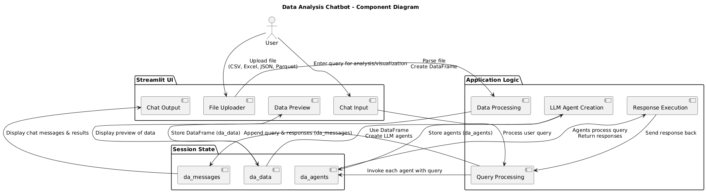

# Cortex AI: Multi-Model Insights Hub

🤖 **Advanced AI-Powered Document Analysis with Multimodal RAG Capabilities**

Cortex AI Hub integrates multiple Large Language Models (LLMs) with a sophisticated **Multimodal Retrieve-and-Generate (RAG)** system, enabling you to extract insights from both **text and visual content** in documents.

**✨ NEW: Multimodal Capabilities** - Now with support for images, charts, graphs, and infographics!

---

## 🌟 **Key Features**

### 🖼️ **Multimodal RAG**

- **📊 Visual Content Understanding**: Analyze images, charts, graphs, and infographics
- **🔗 Unified Text-Image Search**: Search across both textual and visual content
- **🎯 Context-Aware Analysis**: Enhanced understanding with specialized prompts
- **💾 Persistent Storage**: Efficient FAISS-based multimodal embeddings
- **🆓 Free & Local**: Uses open-source models (BLIP, BLIP-2, GIT, CLIP)

### 🔍 **Advanced Search & RAG**

- **🧠 Hybrid Search**: Combines semantic vector search with BM25 keyword search
- **📂 Multi-Document Support**: Upload PDFs or provide URLs
- **💾 Persistent Vector Database**: ChromaDB-powered storage
- **✅ Accurate Citations**: Source-linked responses with references

### 🤖 **AI-Powered Search Agent**

- **🌐 Real-Time Research**: ArXiv, Wikipedia, and web search tools
- **📰 Current Information**: Up-to-date news and research insights
- **⚡ Instant Responses**: Fast, context-aware answers

---

## 🚀 **Supported AI Models**

| Model                         | Provider | Best For                      |
| ----------------------------- | -------- | ----------------------------- |
| llama-3.3-70b-versatile       | Meta     | Complex reasoning, analysis   |
| llama-3.1-8b-instant          | Meta     | Quick queries, fast responses |
| deepseek-r1-distill-llama-70b | DeepSeek | Extended conversations        |
| qwen/qwen3-32b                | Alibaba  | Document summarization        |
| openai/gpt-oss-120b           | OpenAI   | Complex analysis tasks        |

### 🖼️ **Vision Models**

| Model  | Description            | Best For                     |
| ------ | ---------------------- | ---------------------------- |
| BLIP   | Quick image captioning | Speed, basic analysis        |
| BLIP-2 | Advanced understanding | Complex visual content       |
| GIT    | Detailed descriptions  | Charts, graphs, infographics |

---

## 📸 **Application Screenshots**

### 🤖 **RAG Chatbot Interface**


_Traditional RAG chatbot with document upload and multi-LLM selection_

### 🖼️ **Multimodal RAG Interface**


_Enhanced multimodal interface with vision model selection and image analysis_

### 🔍 **Search Agent Interface**


_AI-powered search agent with real-time research capabilities_

---

## 🔄 **System Architecture**

### 📊 **Workflow Diagram**


_Complete multimodal RAG workflow with swimlane organization_

### 🏗️ **System Diagrams**


_High-level system architecture_


_Component interactions and data flow_

---

## 🚀 **Getting Started**

### 📋 **Prerequisites**

- Python 3.12+
- Git
- API Keys: ChatGroq and Tavily

### 📥 **Installation**

1. **Clone Repository**

   ```bash
   git clone https://github.com/RobinMillford/Cortex-AI-Multi-Model-Insights-Hub.git
   cd Cortex-AI-Multi-Model-Insights-Hub
   ```

2. **Setup Environment**

   ```bash
   python -m venv venv
   source venv/bin/activate  # Windows: venv\Scripts\activate
   pip install -r requirements.txt
   ```

3. **Configure API Keys**

   ```bash
   cp .env.template .env
   # Add your GROQ_API_KEY and TAVILY_API_KEY to .env
   ```

4. **Run Application**
   ```bash
   streamlit run Main_Page.py
   ```

### 🌐 **Live Demo**

**[🚀 Try it now](https://cortex-ai-multi-model-insights-app.streamlit.app/)**

---

## 📖 **Usage Guide**

### 🖼️ **Multimodal Document Analysis**

1. Navigate to **"Multimodal RAG"** page
2. Choose vision model (BLIP for speed, GIT for accuracy)
3. Upload PDF with images/charts
4. Enable **"Extract and analyze images"**
5. Ask questions about text and visual content

### 📄 **Traditional Document Chat**

1. Go to **"RAG Chatbot"** page
2. Upload PDFs or enter URLs
3. Configure retrieval parameters
4. Select LLM models for comparison
5. Ask questions and get cited responses

### 🔍 **Research & Web Search**

1. Visit **"Search Agent"** page
2. Enter research queries
3. Choose preferred LLM model
4. Get real-time answers with sources

---

## 🛠️ **Technology Stack**

- **Frontend**: Streamlit with dark theme
- **Backend**: Python, LangChain/LangGraph
- **Vector DB**: ChromaDB (text), FAISS (multimodal)
- **Embeddings**: HuggingFace sentence-transformers, CLIP
- **Vision**: BLIP, BLIP-2, GIT (Hugging Face)
- **LLMs**: Groq API
- **Search**: Tavily, ArXiv, Wikipedia APIs

### 📁 **Project Structure**

```
├── Main_Page.py                 # App entry point
├── multimodal_helpers.py        # Multimodal processing
├── helpers.py                   # Text utilities
├── chain_setup.py               # LLM configuration
├── pages/
│   ├── 1_RAG_Chatbot.py        # Traditional RAG
│   ├── 2_Search_Agent.py       # Web search agent
│   └── 3_Multimodal_RAG.py     # Multimodal interface
├── chroma_db/                   # Text vector storage
├── multimodal_stores/           # Multimodal storage
└── requirements.txt             # Dependencies
```

---

## 🔧 **Key Technical Features**

### 🧠 **Architecture Highlights**

- **Two-Layer Vision**: Vision models → descriptions, CLIP → embeddings
- **Hybrid Search**: Semantic + BM25 for optimal retrieval
- **Model Caching**: Global cache prevents reloading
- **Session Management**: Streamlit state for persistence

### ⚡ **Performance Optimizations**

- Vision models cached globally
- Processed embeddings saved for reuse
- Lazy loading when needed
- Real-time progress feedback

---

## 🤝 **Contributing**

1. Fork the repository
2. Create feature branch: `git checkout -b feature/your-feature`
3. Make changes and test locally
4. Commit and push: `git commit -m "Add feature"`
5. Create Pull Request

### 🎯 **Areas for Contribution**

- 🖼️ New vision models or analysis techniques
- 🔍 Better retrieval algorithms
- 🎨 UI/UX improvements
- 📊 Analytics and metrics
- 🧪 Testing and documentation

---

## 📝 **License**

This project is licensed under the **AGPL-3.0 License**.

---

## 🆘 **Support**

- **🐛 Issues**: [GitHub Issues](https://github.com/RobinMillford/Cortex-AI-Multi-Model-Insights-Hub/issues)
- **💬 Discussions**: [GitHub Discussions](https://github.com/RobinMillford/Cortex-AI-Multi-Model-Insights-Hub/discussions)

---

## 🙏 **Acknowledgments**

- **🤗 Hugging Face**: Free open-source vision models
- **🦙 Meta**: Llama models and CLIP
- **🔍 Salesforce**: BLIP vision models
- **🏢 Microsoft**: GIT vision model
- **⚡ Groq**: Fast LLM inference
- **🌐 Streamlit**: Amazing app framework

---
